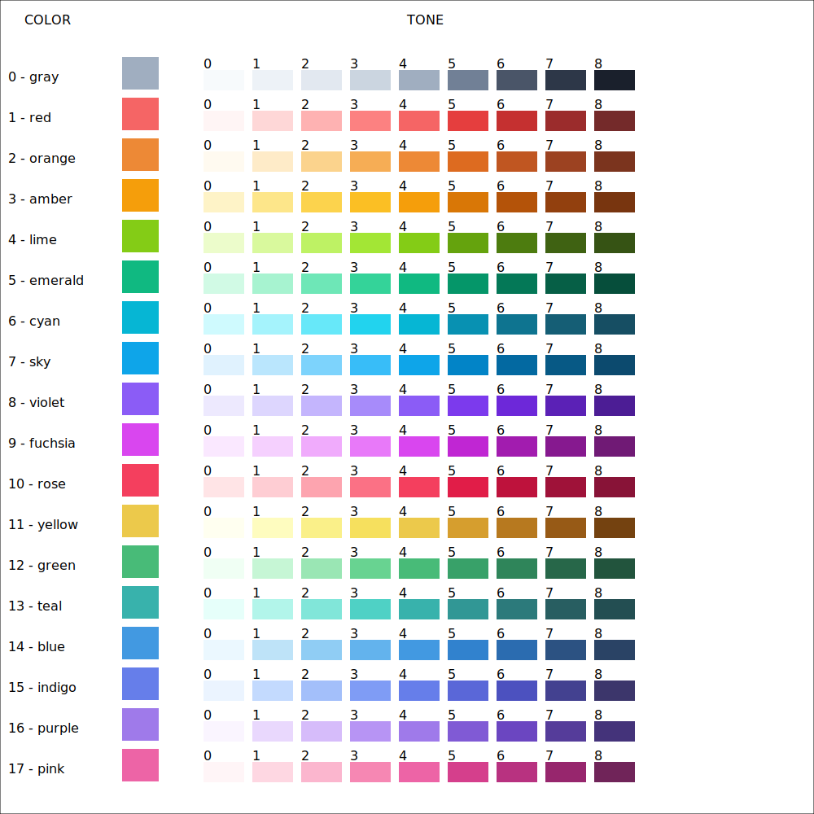

# getcolor.js

#### A function to help use color palettes in javascript

> Marcelo Amorim


## Install

```sh
npm install getcolor.js
```

**IMPORTANT:** getcolor.js is ESM. 

## Usage

```js
import { color, colorName } from 'getcolor.js';

let value = color(3,4)
console.log('value:',value);
//=> value: #f59e0b

let value2 = color("amber")
console.log('value2:',value2);
//=> value: #f59e0b

let name = colorName[3]
console.log('name:',name);
//=> name amber
```

## COLOR SAMPLE

